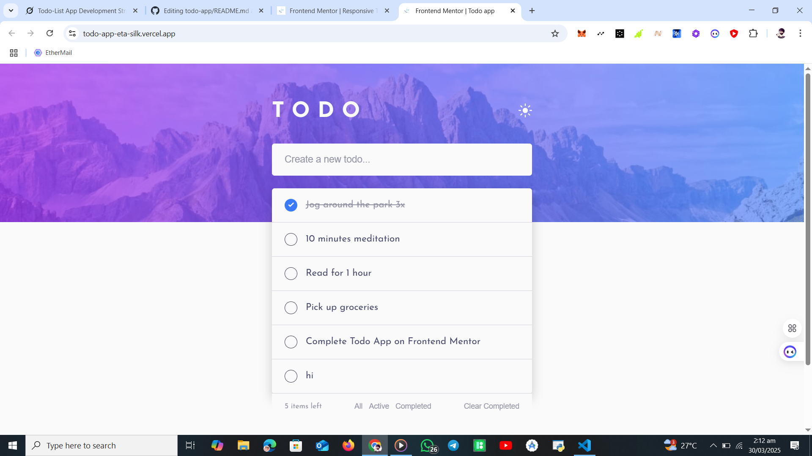

# Frontend Mentor - Todo App Solution

This is a solution to the [Todo app challenge on Frontend Mentor](https://www.frontendmentor.io/challenges/todo-app-Su1_KokOW). Frontend Mentor challenges help you improve your coding skills by building realistic projects.

## Overview

### The Challenge

Users should be able to:

- View the optimal layout for the app depending on their device's screen size
- See hover states for all interactive elements on the page
- Add new todos to the list
- Mark todos as complete
- Delete todos from the list
- Filter by all/active/complete todos
- Clear all completed todos
- Toggle light and dark mode
- **Bonus**: Drag and drop to reorder items on the list

### Screenshot



### Links

- Solution URL: [Frontend Mentor Solution](https://www.frontendmentor.io/solutions/responsive-todo-app-with-drag-and-drop-and-local-storage-8yAfSIqB5h) 
- Live Site URL: [Live Site on Vercel](https://todo-app-eta-silk.vercel.app/)
- Repository URL: [GitHub Repository](https://github.com/JayeBlack/todo-app)

## My Process

### Built With

- Semantic HTML5 markup
- CSS custom properties
- Flexbox
- Vanilla JavaScript
- Local Storage for data persistence
- HTML Drag and Drop API
- Mobile-first workflow

### What I Learned

This project was a great opportunity to deepen my understanding of front-end development with vanilla JavaScript. Here are some key takeaways:

- **Drag-and-Drop Functionality**: I learned how to use the HTML Drag and Drop API to enable reordering of the todo list. Handling the `dragstart`, `dragover`, `drop`, and other events was a new experience, and I’m proud of how smooth the reordering feels.

```javascript
todoList.addEventListener('drop', (e) => {
  e.preventDefault();
  const targetItem = e.target.closest('.todo-item');
  if (targetItem && targetItem !== draggedItem) {
    const draggedId = parseInt(draggedItem.dataset.id);
    const targetId = parseInt(targetItem.dataset.id);
    const draggedIndex = todos.findIndex(todo => todo.id === draggedId);
    const targetIndex = todos.findIndex(todo => todo.id === targetId);
    const [draggedTodo] = todos.splice(draggedIndex, 1);
    todos.splice(targetIndex, 0, draggedTodo);
    renderTodos();
  }
});